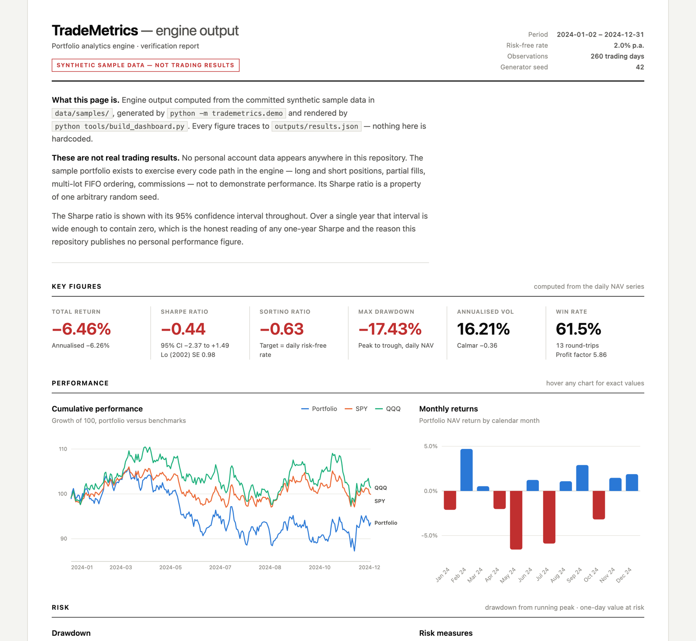

# TradeMetrics

[](https://github.com/hugomagee/TradeMetrics/actions/workflows/ci.yml)
[](https://python.org)
[](LICENSE)

A Python engine that measures portfolio performance and risk, plus a notebook that proves the engine is correct by testing it on simulated data where the right answer is known in advance.



## At a glance

**Input:** three CSVs: daily portfolio value, a trade log (buys, sells, shorts, commissions) and benchmark prices (SPY, QQQ). The repo ships synthetic samples; my own brokerage data stays private.

**Transformation:**
* Sharpe ratio with a standard error and 95% confidence interval (Lo, 2002)
* Sortino ratio, max drawdown, Calmar ratio
* CAPM alpha and beta on excess returns, with confidence intervals
* Value at Risk, parametric and historical side by side
* FIFO profit and loss for long and short trades, net of commissions, including partial fills
* Position sizing: fractional Kelly, volatility targeting and true equal risk contribution

**Output:** `outputs/results.json` and a single file HTML report that works offline

**What I learned:** most performance numbers need an error bar, and one year of returns barely tells you anything

## Why I rebuilt it

I first built this to analyse my own portfolio. Reading it back later, almost every number feeding the headline Sharpe ratio was wrong:

* Sortino used the wrong downside deviation
* Alpha was regressed on raw returns instead of excess returns
* VaR used a hardcoded lookup table
* The FIFO matcher loaded commissions but never subtracted them, and silently dropped every short sale

So I rebuilt it test first and changed the question from "what did my portfolio do?" (which a reader can't check) to "is this code right?" (which anyone can check from a fresh clone).

## What the validation notebook shows

[`analysis/metric_validation.ipynb`](analysis/metric_validation.ipynb) runs entirely on simulated data with known true values:

* **The estimators are unbiased.** Each metric matches a hand calculation to machine precision.
* **The error bars are honest.** 95% Sharpe intervals contain the true value 95.6% of the time across 2,000 simulated years.
* **One year is mostly noise.** The standard error of a one year Sharpe is about 1.0, the same size as a typical estimate. A true Sharpe of 1.0 needs about 5.8 years of data to separate from zero.
* **Luck looks like skill.** The best of 1,000 traders with zero skill posts a one year Sharpe above 3.2.
* **Leverage looks like alpha.** A 1.8× leveraged portfolio with zero alpha by design beats its benchmark by 10 points over three years. CAPM correctly assigns 98.9% of that to beta.
* **FIFO is exact.** Six hand worked trade sequences all match to the cent.

## How to run

Requires Python 3.12+.

```bash
git clone https://github.com/hugomagee/TradeMetrics.git
cd TradeMetrics
python3 -m venv .venv && source .venv/bin/activate
pip install -r requirements.txt
python -m trademetrics.demo           # prints every metric for the sample portfolio
python tools/build_dashboard.py       # writes trademetrics.html
pytest                                # 79 tests
```

The demo is fully deterministic (fixed seed, fixed dates), so it prints the same output on every machine. The sample portfolio's Sharpe comes out negative, and that is meaningless by design. The sample data exists to exercise every code path (longs, shorts, partial fills, multiple lots, commissions), not to show performance.

## How the code is organised

* `trademetrics/metrics.py`: Sharpe with confidence interval, Sortino, VaR, drawdown
* `trademetrics/fifo.py`: long and short FIFO matching with commission adjusted P&L
* `trademetrics/benchmark.py`: CAPM alpha and beta on excess returns
* `trademetrics/attribution.py`: realised P&L by ticker, sector and period
* `trademetrics/sizing.py`: Kelly, volatility targeting, equal risk contribution
* `trademetrics/simulate.py`: generators with known parameters, used by the notebook
* `tests/`: 79 tests, each metric checked against a hand computed value
* `docs/ANALYSIS_NOTES.md`: every methodology choice and the case against it

All sample data is generated from fixed seeds by `tools/make_sample_data.py`, and a test checks the committed CSVs still match the generator exactly.

## Stack

Python, pandas, NumPy, SciPy, pytest, ruff, Jupyter, GitHub Actions. The report is plain HTML with inline SVG charts and no JavaScript libraries.

## Author

Hugo Magee · MSc Business Analytics and Data Science, IE University · [LinkedIn](https://linkedin.com/in/hugo-magee-ooo) · hugomagee2002@gmail.com

MIT licence
